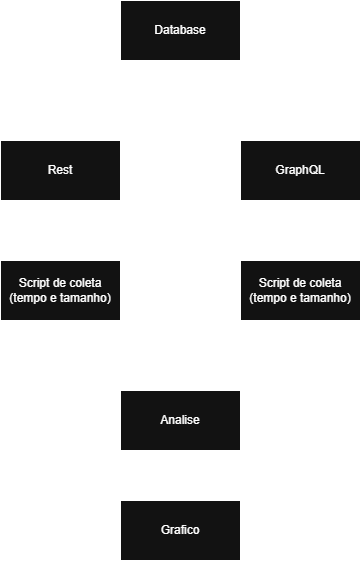

# README – Experimento Controlado: GraphQL vs REST

## Objetivo

Este experimento tem como objetivo comparar o desempenho entre APIs REST e GraphQL no contexto de tempo de resposta e tamanho da resposta. A execução será feita utilizando **Python** para envio das requisições e coleta dos dados.

## Passo 1 – Desenho do Experimento

### Hipóteses

* **H0 (Hipótese Nula):** Não há diferença significativa entre REST e GraphQL em termos de tempo e tamanho de resposta.
* **H1 (Hipótese Alternativa):** GraphQL possui menor tempo de resposta e/ou menor tamanho de resposta em relação ao REST.

### Variáveis

* **Independente:** Tipo de API utilizada (REST ou GraphQL).
* **Dependentes:** Tempo de resposta (ms) e Tamanho da resposta (bytes).

### Tratamentos

* Implementar endpoints REST e GraphQL equivalentes.
* Executar requisições idênticas a ambos os tipos de API.

### Objetos Experimentais

* API REST desenvolvida em Node.js ou outro backend.
* API GraphQL com mesma base de dados.
* Scripts Python para envio das requisições.
* Base de dados (ex: usuários, produtos).

### Tipo de Projeto Experimental

* **Experimento controlado** com comparação de dois grupos (REST vs GraphQL).

### Quantidade de Medições

* Mínimo de 30 requisições para cada API, em diferentes horários e cenários.

### Ameaças à Validade

* Variação na rede/internet.
* Cache de consultas.
* Diferenças de implementação entre REST e GraphQL.
* Carga do servidor durante os testes.

### Fluxograma do experimento

Insira abaixo a imagem ilustrando o desenho do experimento (banco de dados, APIs, scripts e coleta de dados):

<p align="center">
  
</p>

## Passo 2 – Preparação do Experimento

### Ferramentas

* **Linguagem:** Python 3.x
* **Bibliotecas:**

  * `requests`: Para envio das requisições HTTP
  * `time`: Para medir o tempo de resposta
  * `json`: Para manipulação dos dados
  * `pandas`: Para análise dos dados
  * `matplotlib` / `seaborn`: Para visualização gráfica dos resultados

### Estrutura do Projeto

```
experimento-graphql-vs-rest/
├── apis/
│   ├── rest_api/        # Implementação REST
│   └── graphql_api/     # Implementação GraphQL
├── scripts/
│   ├── test_rest.py     # Script para REST
│   ├── test_graphql.py  # Script para GraphQL
├── data/
│   └── resultados.csv   # Dados coletados
├── README.md
└── requirements.txt     # Bibliotecas Python
```

### Preparação

* Configurar as APIs REST e GraphQL com base de dados compartilhada.
* Escrever os scripts Python que realizam requisições às APIs.
* Garantir que os scripts salvem os dados (tempo/tamanho) em um arquivo `.csv`.

## Execução (Passo 3)

* Após a preparação, os testes serão executados com medições cronometradas e coleta dos tamanhos de resposta.

## Análise (Passo 4 e 5)

* Análise estatística será feita com Pandas/Seaborn e discutida no relatório final.

## Dashboard (Passo 6)

* Será criado um dashboard com visualizações claras das diferenças entre REST e GraphQL com base nas métricas de tempo e tamanho.
